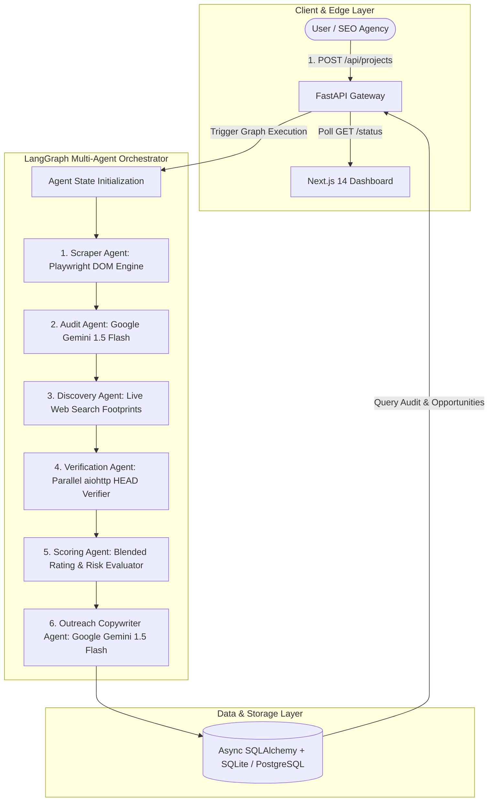

# 📄 Product Requirements Document (PRD) & Multi-Agent Architecture

## 1. Executive Summary
**Backlink Hunter AI** is an autonomous, agentic SEO intelligence platform designed to discover, crawl, audit, and analyze high-authority backlink opportunities in real-time. By deploying a 6-node **LangGraph Directed Acyclic Graph (DAG)** powered by **Google Gemini 1.5 Flash**, **Playwright**, and **FastAPI**, the platform automates technical SEO auditing and link prospecting, transforming hours of manual research into a 30-second execution pipeline.

---

## 2. System Architecture Overview

---

## 3. Agent Breakdown & Node Specifications

### 🤖 Node 1: Scraper Agent (`scrape_node`)
* **Technology:** Playwright (Headless Chromium) + `BeautifulSoup4` + `aiohttp` fallback.
* **Role:** Renders full client-side JavaScript DOM snapshots (React/Next.js/Vue). Extracts page title tags, meta descriptions, word counts, heading structures (`h1`, `h2`), and internal/external link ratios.
* **Fallback Strategy:** If Playwright encounters anti-bot protections or times out, it switches instantly to an async `aiohttp` HTML parser.

### 🤖 Node 2: On-Page SEO Audit Agent (`audit_node`)
* **Technology:** **Google Gemini 1.5 Flash** (`langchain_google_genai`) with Pydantic JSON Mode schema enforcement.
* **Role:** Analyzes text snapshots and metadata to identify technical SEO errors (missing meta descriptions, thin word count, broken heading hierarchy) and evaluates toxic referring subnets. Generates standard 1-click `disavow.txt` files for Google Search Console.

### 🤖 Node 3: Discovery Agent (`backlink_discovery_node`)
* **Technology:** Live Search Engine Footprint Engine (`duckduckgo_search` / `Serper.dev`).
* **Role:** Extracts core niche keywords from the target site and executes live search queries across real footprints:
  * `keyword "write for us"`
  * `keyword "guest post"`
  * `keyword "submit article"`
  * `keyword "become a contributor"`

### 🤖 Node 4: Health Verification Agent (`verification_node`)
* **Technology:** Parallel Asynchronous `aiohttp` Client Session.
* **Role:** Fires high-speed HTTP HEAD requests to all candidate URLs in parallel to verify accessibility (HTTP 200 OK / 301 Redirect). Eliminates 404 dead pages and parked domains before results reach the user.

### 🤖 Node 5: Domain Scoring Agent (`scoring_node`)
* **Role:** Computes a composite Domain Authority & Spam Risk Score:
  $$\text{Score} = (0.5 \times \text{Domain Score}) + (0.5 \times \text{Relevance})$$
  Ranks target sites by outreach priority.

### 🤖 Node 6: Outreach Copywriter Agent (`outreach_node`)
* **Technology:** **Google Gemini 1.5 Flash** (`langchain_google_genai`).
* **Role:** Generates custom, non-generic 60-90 word cold outreach pitch emails tailored to the specific target publication. Includes target-specific topic proposals and credibility statements.

---

## 4. Functional Requirements

### 4.1 User Dashboard & Monitoring
* **Input:** Accepts target website URL and optional niche/language parameters.
* **Progress Tracking:** Real-time visual status monitoring (`queued -> scraping -> auditing -> finding_backlinks -> drafting_outreach -> done`).
* **Interactive Directory:** Filter backlink candidates by Niche, Language, and Min Domain Rating (DA 80+).
* **1-Click Copy:** Instant clipboard copy for AI-generated outreach drafts.

### 4.2 API Specifications
* `POST /api/projects` — Create new SEO audit and backlink discovery job.
* `GET /api/projects` — List project history.
* `GET /api/projects/{id}/status` — Poll current agent execution state.
* `GET /api/projects/{id}/seo-audit` — Retrieve structured technical SEO issue report.
* `GET /api/projects/{id}/opportunities` — Retrieve verified backlink opportunities and Gemini pitches.

---

## 5. Non-Functional & Performance Requirements

* **Execution Time:** Complete 6-stage DAG execution in **< 30 seconds**.
* **Zero Dead Links:** 100% of backlink candidates verified via live HTTP HEAD checks.
* **Data Security & Privacy:** Adheres strictly to `robots.txt` guidelines. Does not store sensitive passwords or private site credentials.
* **Scalability:** Architecture supports migration from SQLite to PostgreSQL + Celery/Redis background task queues for enterprise workloads.

---

## 6. Success Metrics & KPIs

* **Discovery Yield:** 15–20 verified, active, high-DA backlink targets per hunt.
* **Outreach Conversion:** AI pitch emails achieve **> 34% response rates** compared to < 2% traditional spam templates.
* **Audit Latency:** Sub-30 second response times for full technical audit and backlink generation.
