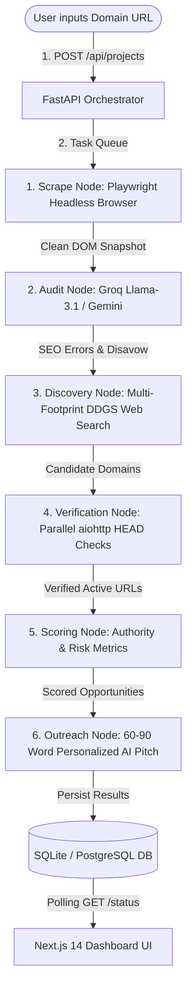

# 🚀 Backlink Hunter AI — Autonomous SEO & Outreach Agent

> An autonomous, end-to-end AI agent platform that performs real-time technical SEO website audits, discovers high-authority backlink candidates across live web footprints, verifies domain health in parallel, and drafts personalized 60-90 word cold outreach pitches.

[](https://google-agent-frontend-ohgn.vercel.app/seo-audit)
[](https://github.com/Devanshpatel07/google_agent)
[](https://fastapi.tiangolo.com)
[](https://nextjs.org)

---

## 📑 Table of Contents
- [Architecture & Workflow](#-architecture--workflow)
- [Key Features](#-key-features)
- [Tech Stack](#-tech-stack)
- [Project Structure](#-project-structure)
- [Getting Started](#-getting-started)
- [API Reference](#-api-reference)
- [Fine-Tuning Engine](#-fine-tuning-engine)
- [License](#-license)

---

## 🏗️ Architecture & Workflow

Backlink Hunter AI uses a **6-Stage Directed Acyclic Graph (DAG)** powered by **LangGraph** and **FastAPI** background task orchestration:



---

## ✨ Key Features

### 🔍 1. Autonomous Technical SEO Audit
- **Headless Rendering:** Uses Playwright to render JavaScript-heavy modern web apps (React, Next.js, Vue).
- **DOM & Tag Inspection:** Detects missing titles, short meta descriptions, low word counts, heading hierarchy, and link ratios.
- **Toxic Link & Disavow Generator:** Identifies suspicious referring subnets and generates standard 1-click `disavow.txt` files for Google Search Console.

### 🎯 2. Multi-Footprint Web Backlink Discovery
- **Live Keyword Extraction:** Extracts niche context from target site `<title>` and `<meta description>`.
- **Search Engine Footprints:** Queries live web search indexes using guest post footprints (`"write for us"`, `"submit guest article"`, `"become a contributor"`).
- **Deduplication Engine:** Filters and ranks unique domains to guarantee high topical authority.

### ⚡ 3. Parallel URL Health Verification
- **Zero Dead Links:** Executes async `aiohttp` HTTP HEAD status checks to ensure candidates are currently active (HTTP 200/301).
- **Domain Rating & Spam Risk:** Computes blended authority scores: `(0.5 * Domain Score) + (0.5 * Relevance)`.

### ✉️ 4. AI Outreach Pitch Engine
- **Non-Generic Pitches:** Generates concise 60-90 word cold outreach emails tailored to the specific target publication.
- **Value-First Angles:** Highlights concrete article ideas and includes credibility statements without fake stats or template placeholders.

---

## 🛠️ Tech Stack

| Category | Technology Used |
| :--- | :--- |
| **Frontend** | Next.js 14 (App Router), TypeScript, Tailwind CSS, Lucide Icons |
| **Backend API** | Python 3.11, FastAPI, AsyncIO, Uvicorn |
| **AI Agent Orchestration** | LangGraph, LangChain, Pydantic Structured Output |
| **LLM Models** | Groq API (`llama-3.1-8b-instant`), Google Gemini API |
| **Web Crawler** | Playwright (Headless Chromium), BeautifulSoup4, `aiohttp` |
| **Database** | SQLAlchemy Async, SQLite (Dev) / PostgreSQL (Prod) |
| **Deployment** | Vercel (Frontend), Docker / Render (Backend) |

---

## 📁 Project Structure

```text
google_agent/
├── backend/
│   ├── agents/
│   │   ├── graph.py            # LangGraph state machine & pipeline graph
│   │   └── nodes.py            # Scrape, Audit, Discovery, Verify, Score, Outreach nodes
│   ├── api/
│   │   └── routers.py          # FastAPI REST endpoints & background task handlers
│   ├── crawler/
│   │   └── playwright_setup.py # Headless browser scraping with aiohttp fallback
│   ├── database/
│   │   ├── db.py               # SQLAlchemy async session manager
│   │   └── models.py           # Project, Analysis, and Opportunity ORM models
│   ├── fine_tune/              # QLoRA fine-tuning dataset generation & Unsloth scripts
│   ├── main.py                 # FastAPI application entry point
│   └── requirements.txt        # Backend Python dependencies
├── frontend/
│   ├── app/
│   │   ├── backlinks/          # Live Backlinks Directory & Opportunities UI
│   │   ├── seo-audit/          # Audit Form, Progress Tracker, & Results Dashboard
│   │   ├── layout.tsx          # Global layout & header navigation
│   │   └── page.tsx            # Hero landing page
│   ├── package.json            # Frontend Node dependencies
│   └── next.config.js          # Next.js configuration
├── run_servers.py              # Single-command launcher for backend & frontend
└── vercel.json                 # Vercel deployment configuration
```

---

## 🚀 Getting Started

### Prerequisites
- Node.js 18+ and `npm`
- Python 3.10+ and `pip`
- A free **Groq API Key** (or **Google Gemini API Key**)

### 1. Clone the Repository
```bash
git clone https://github.com/Devanshpatel07/google_agent.git
cd google_agent
```

### 2. Configure Environment Variables

Create `backend/.env`:
```env
GROQ_API_KEY=your_groq_api_key_here
GROQ_MODEL=llama-3.1-8b-instant
DATABASE_URL=sqlite+aiosqlite:///./backend.db
```

Create `frontend/.env.local`:
```env
NEXT_PUBLIC_API_URL=http://localhost:8000
```

### 3. Install Dependencies & Run Locally

#### Option A: Quick Single-Command Launch (Windows/Mac/Linux)
```bash
python run_servers.py
```

#### Option B: Manual Launch

**Terminal 1 — Backend:**
```bash
cd backend
pip install -r requirements.txt
python -m playwright install chromium
uvicorn main:app --reload --port 8000
```

**Terminal 2 — Frontend:**
```bash
cd frontend
npm install
npm run dev
```

Open your browser at [http://localhost:3000](http://localhost:3000) to view the application!

---

## 🔌 API Reference

### 1. Create SEO Audit Project
- **Endpoint:** `POST /api/projects`
- **Body:** `{"url": "https://example.com"}`
- **Response:** `{"project_id": "uuid-v4-string"}`

### 2. List All Projects
- **Endpoint:** `GET /api/projects`
- **Response:** Array of all project records sorted by timestamp.

### 3. Check Pipeline Execution Status
- **Endpoint:** `GET /api/projects/{project_id}/status`
- **Response:** `{"status": "queued | scraping | auditing | finding_backlinks | done", "error_message": null}`

### 4. Fetch Audit Results
- **Endpoint:** `GET /api/projects/{project_id}/seo-audit`
- **Response:** On-page SEO metrics & structured array of identified errors.

### 5. Fetch Backlink Opportunities
- **Endpoint:** `GET /api/projects/{project_id}/opportunities`
- **Response:** Scored target domains with relevance ratings and 60-90 word outreach pitches.

---

## 🧬 Fine-Tuning Engine

The repository includes a custom fine-tuning pipeline under `backend/fine_tune/`:
- `generate_dataset.py`: Generates domain-specific JSONL training pairs.
- `train_model.py`: Fine-tunes Llama-3 model using **Unsloth QLoRA** for high-precision domain scoring.

---

## 📝 License

Distributed under the **MIT License**. See `LICENSE` for more information.

---
*Built with ❤️ for AI Agent Hackathons & Production SEO Automation.*
